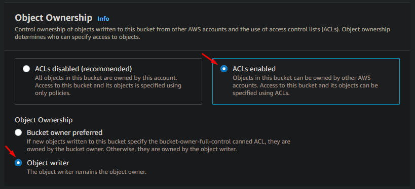
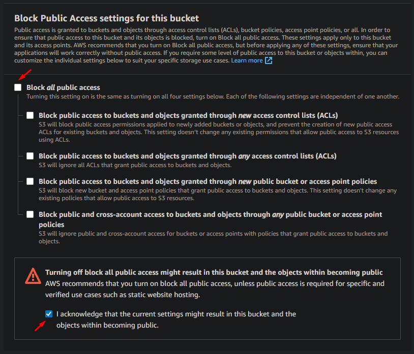
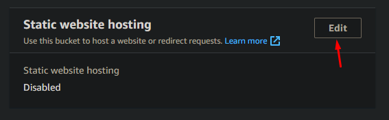
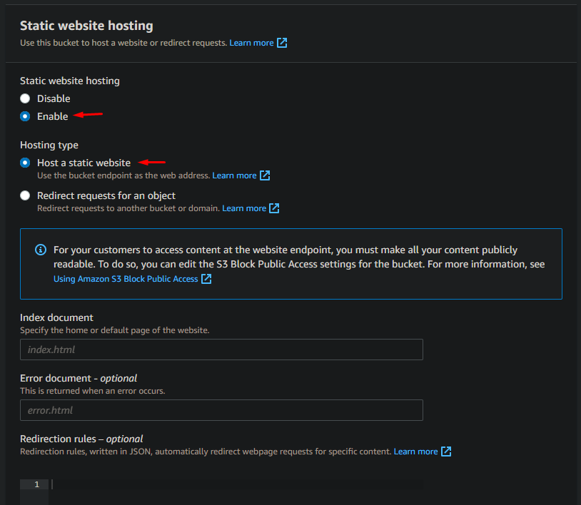

# UServer SPA Bucket Gateway

[](https://opensource.org/licenses/MIT)

<p align="center">
  
</p>

---

A reverse-proxy docker image to be used as the gateway for S3-hosted SPAs (serverless distribution).

This service is intended to run along the [uServer](https://github.com/ferdn4ndo/userver) stack, depending specifically on [uServer-Web](https://github.com/ferdn4ndo/userver-web) to handle the SSL certificates, perform the host monitoring, and act as the main DNS for the reverse proxy. For this reason, the `VIRTUAL_HOST` environment variable must be set to a comma-separated string containing all the domains that will redirect to S3-hosted SPAs, along with the public domain of the gateway (if you want to check its health state). If you're not running behind the uServer proxy, this variable can be left empty.

Then, inside the websites folder, you'll define the details (bucket and host) for each of the SPAs. A model (template) is available at `websites/demo-repo.json.template`. Just _copy&paste_ and edit it accordingly, while keeping the `.json` extension. The file name does not affect the domain.

## Summary

1. [How to run](#how-to-run)
2. [Configuration](#configuration)
    1. [Environment Variables](#environment-variables)
        * [VIRTUAL_HOST](#virtual_host)
        * [DEMO_DEPLOY_BUCKET](#demo_deploy_bucket)
        * [DEMO_DEPLOY_REGION](#demo_deploy_region)
        * [DEMO_REPO_DOMAIN](#demo_repo_domain)
        * [SLS_KEY](#sls_key)
        * [SLS_SECRET](#sls_secret)
        * [DEBUG](#debug)
        * [TRAILING_SLASH](#trailing_slash)
    2. [Websites](#websites)
    3. [AWS S3 Bucket](#bucket-configuration)
3. [F.A.Q.](#faq)
    1. [Why not handle HTTPS (SSL)?](#1---why-not-handle-https-ssl)
    2. [I found a bug / I want a new feature. What should I do?](#2---i-found-a-bug--i-want-a-new-feature-what-should-i-do)
    3. [There's an error while creating the bucket](#3---theres-an-error-while-creating-the-bucket)
4. [Code of Conduct](#code-of-conduct)
5. [License](#license)
6. [Contributors](#contributors)

## How to run

Assuming you have already configured the environment variables, the files inside the `websites` folder and the AWS bucket (please check the [Configuration](#configuration) section for more info), you can run the service by executing:

```bash
docker compose up
```

The `docker-compose.yml` will map the local files to the docker container (so the files are updated)

[Back to top](#userver-spa-bucket-gateway)

## Configuration

To properly configure the service, you must check three items:

* the environment variables (from the `.env.template` file);
* the website(s) `*.json` file(s);
* the AWS S3 bucket(s);

Each of them is described in the sections below.

[Back to top](#userver-spa-bucket-gateway)

### Environment Variables

To configure the environment variables, copy the template file (located under the project root named `.env.template`) to the `.env` one:

```bash
cp .env.template .env
```

Then edit the `.env` file according to the specifications:

#### **VIRTUAL_HOST**

This variable will store the comma-separated list of public domains that the service will handle. Despite duplicating some information from the websites folder, this variable is only required when running the container behind another reverse-proxy tool (like what we do on [uServer-Web](https://github.com/ferdn4ndo/userver-web)). If you plan to use this service as the upfront gateway of your application, you can leave this value empty.

```bash
# It should contain all the domains (and subdomains) handled by the gateway
VIRTUAL_HOST=domain1.com,app.domain1.com,www.domain1.com,domain2.com
```

_THIS VARIABLE IS REQUIRED WHEN RUNNING BEHIND ANOTHER REVERSE PROXY!_

[Back to top](#userver-spa-bucket-gateway)

#### **DEMO_DEPLOY_BUCKET**

If you plan to deploy the demo application, use this variable to inform the bucket name where the files will be pushed.

```bash
# The bucket name to where the demo application will be deployed
DEMO_DEPLOY_BUCKET=my-bucket-name
```

Default: _\<EMPTY\>_

_THIS VARIABLE IS REQUIRED WHEN DEPLOYING THE DEMO APP!_

[Back to top](#userver-spa-bucket-gateway)

#### **DEMO_DEPLOY_REGION**

If you plan to deploy the demo application, use this variable to inform the bucket region where the files will be pushed.

```bash
DEMO_DEPLOY_REGION=us-east-1
```

Default: _\<EMPTY\>_

_THIS VARIABLE IS REQUIRED WHEN DEPLOYING THE DEMO APP!_

[Back to top](#userver-spa-bucket-gateway)

#### **DEMO_REPO_DOMAIN**

If you plan to deploy the demo application, use this variable to inform the public domain where the gateway should expose the app.

```bash
DEMO_REPO_DOMAIN=app.domain1.com
```

Default: _\<EMPTY\>_

_THIS VARIABLE IS REQUIRED WHEN DEPLOYING THE DEMO APP!_

[Back to top](#userver-spa-bucket-gateway)

#### **SLS_KEY**

If you plan to deploy the demo application, use this variable to inform the AWS Key to use when connecting to the Amazon services.

```bash
SLS_KEY=A123456789KEY
```

Default: _\<EMPTY\>_

_THIS VARIABLE IS REQUIRED WHEN DEPLOYING THE DEMO APP!_

[Back to top](#userver-spa-bucket-gateway)

#### **SLS_SECRET**

If you plan to deploy the demo application, use this variable to inform the AWS Secret to use when connecting to the Amazon services.

```bash
SLS_SECRET="4WsK3yT0pS3cR3tW1th3sP3ci@lCh4rs#"
```

Default: _\<EMPTY\>_

_THIS VARIABLE IS REQUIRED WHEN DEPLOYING THE DEMO APP!_

[Back to top](#userver-spa-bucket-gateway)

#### **DEBUG**

Setting this variable to `1` will append some debugging information in the response headers passing through this gateway. The headers will have the key starting with `X-Debug-*`.

```bash
# This will enable some extra Response Headers in the format X-Debug-*
DEBUG=1
```

Default: _0_

[Back to top](#userver-spa-bucket-gateway)

#### **TRAILING_SLASH**

Setting this variable to `append` will append a trailing slash to the redirect URLs (so a request to `mydomain.com/slug` will become `mydomain.com/slug/`).

Setting this variable to `trim` will remove a trailing slash of the redirect URLs (so a request to `mydomain.com/slug/` will become `mydomain.com/slug`).

Leaving this variable blank (or using any other value for it) will imply not changing the URL at all.

```bash
# This will add a trailing slash to every request (if not present)
TRAILING_SLASH=append
```

Default: _\<EMPTY\>_

[Back to top](#userver-spa-bucket-gateway)

### Websites

To configure the websites that will run behind the proxy gateway, adjust the files inside the `websites/` folder.

Every `*.json` file inside the `websites/` folder is considered a different website. There's a demo JSON file named `demo-repo.json.template` (skipped from the gateway as it does not end with `.json`). This file can be used to deploy the demo application (by filling the missing information and renaming the file to `demo-repo.json`), or can be used as a template for your websites:

```json
{
  "BUCKET_URL": "<bucket-name>.s3-website-<region>.amazonaws.com",
  "DOMAIN": "<the public domain to use with the reverse proxy>"
}
```

So assuming the demo application was deployed in the bucket `my-bucket` (inside the region `us-east-1`) and the public domain (registered in the DNS server that points to the container's host IP) is `my-application.com`, the JSON configuration file would be:

```json
{
  "BUCKET_URL": "my-bucket.s3-website-us-east-1.amazonaws.com",
  "DOMAIN": "my-application.com"
}
```

After updating the websites, remember to restart the `nginx` server by running:

```
docker container restart userver-spa-bucket-gateway
```

There's a plan to add a hot-reload feature that will automatically restart the service using `inotify`, but this is still a nice-to-have.

[Back to top](#userver-spa-bucket-gateway)

### Bucket Configuration

When creating the bucket that will store your application static files, you must change the following settings:

#### **1 - Enable ACL and Object Ownership**

Under the _Object Ownership_ section, set the ACLs configuration to **ACLs enabled** and the object ownership to **Object writer**.



#### **2 - Allow Public Access**

Under the _Block Public Access settings for this bucket_ section, uncheck the "**Block all public access**" checkbox and check the "**I acknowledge that the current settings might result in this bucket and the objects within becoming public** "one.



#### **3 - Website Configuration**

After creating the bucket, access its configurations and go to the bucket page in the AWS S3 Console, and navigate to the "Properties" tab. At the bottom of the page, click on the "Edit" button inside the "Static website hosting" section:



Then, in the new section that is shown, mark the "Enabled" option inside "Static website hosting" and make sure that the "Host a static website" option is also checked.



If your website requires, you can change the **Index document** and the **Error document** to match the filenames inside your bucket.

After that, you can save the changes and the bucket is ready to be served through the gateway!

Of course, you may need to upload your website files too! :grin:

This can be done directly through the AWS S3 interface or using `aws-cli`. For example, to upload the demo bucket content to your bucket (assuming it's named `my-bucket`), you could use the command:

```bash
aws s3 cp --acl public-read demo-repo-content/ s3://my-bucket --recursive
```

This command is also available in the executable file `deploy-demo-repo.sh`, which assumes that the bucket name is stored in the environment variable "**DEMO_DEPLOY_BUCKET**"

[Back to top](#userver-spa-bucket-gateway)

## FAQ

### 1 - Why not handle HTTPS (SSL)?

R: Because this is already implemented in the [uServer-Web](https://github.com/ferdn4ndo/userver-web) domain. We don't handle firewall/monitoring here for the same reason.

[Back to top](#userver-spa-bucket-gateway)

### 2 - I found a bug / I want a new feature. What should I do?

R: Open an issue in this repository. Please describe your request as detailed as possible (remember to attach binary/big files externally), and wait for feedback. If you're familiar with software development, feel free to open a Pull Request with the suggested solution. Contributions are welcomed!

Please be aware that you must comply to our [Code of Conduct](#code-of-conduct).

[Back to top](#userver-spa-bucket-gateway)

### 3 - There's an error while creating the bucket

R: This is normally related to the permissions of the IAM user (defined by the `.env` variables `SLS_KEY` and `SLS_SECRET`). We recommend you try a less-strict policy for the required services (like `AdminAccess` to `S3`) in a controlled environment so you can make it work first, then iterate removing permissions one by one.

[Back to top](#userver-spa-bucket-gateway)

## Code of Conduct

When interacting with the project, this repository, and/or any contributor, you must attend to our [Code of Conduct](docs/CODE_OF_CONDUCT.md).

[Back to top](#userver-spa-bucket-gateway)

## License

This application is distributed under the [MIT](https://github.com/ferdn4ndo/userver-spa-bucket-gateway/blob/main/LICENSE) license.

[Back to top](#userver-spa-bucket-gateway)

## Contributors

[ferdn4ndo](https://github.com/ferdn4ndo)

Any help is appreciated! Feel free to review, open an issue, fork, and/or open a PR.

[Back to top](#userver-spa-bucket-gateway)
