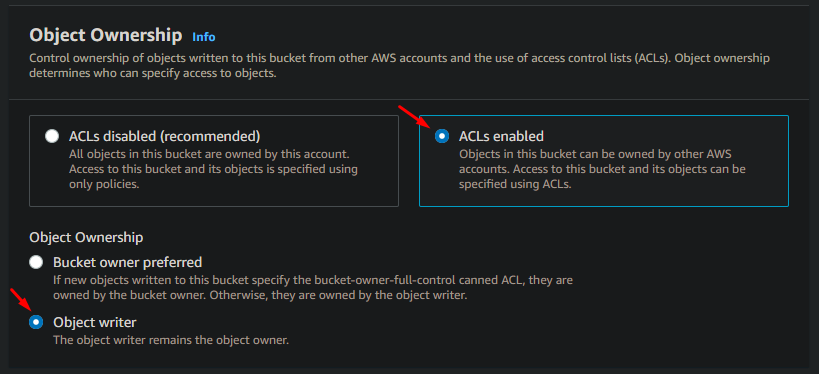
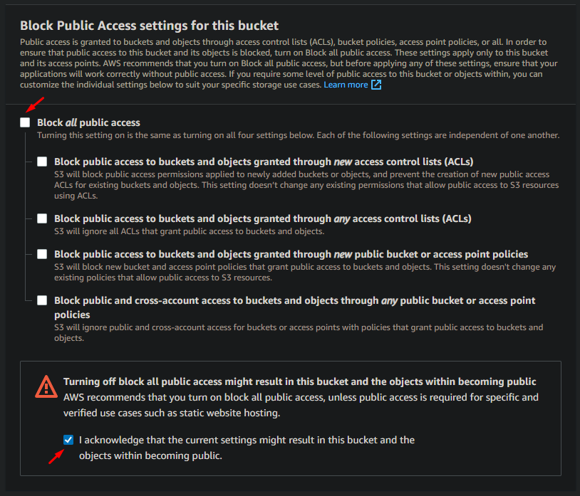
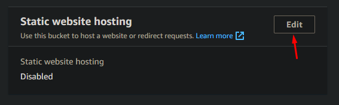
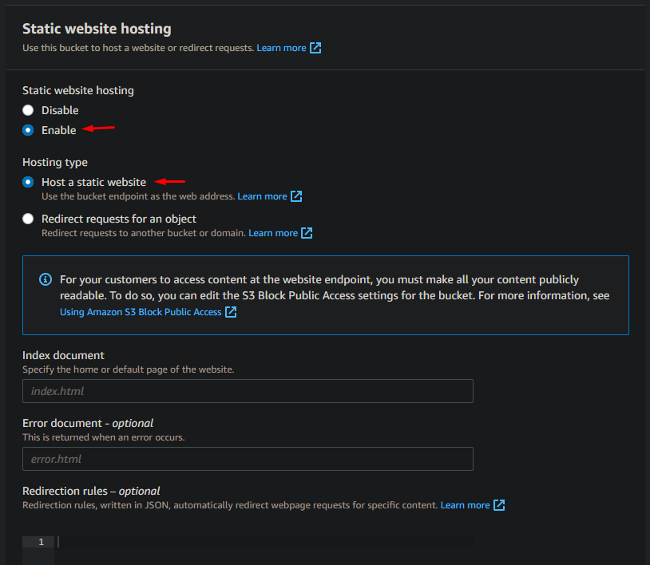

# UServer SPA Bucket Gateway

[](https://github.com/ferdn4ndo/userver-spa-bucket-gateway/actions/workflows/test_e2e.yml)
[](https://github.com/ferdn4ndo/userver-spa-bucket-gateway/actions/workflows/test_code_leaks.yml)
[](https://github.com/ferdn4ndo/userver-spa-bucket-gateway/actions/workflows/test_code_quality.yml)
[](https://github.com/ferdn4ndo/userver-spa-bucket-gateway/releases)
[](https://opensource.org/licenses/MIT)

<p align="center">
  
</p>

---

Docker image (nginx) that acts as a reverse proxy gateway for static SPAs served from **Amazon S3 static website** endpoints. It maps public hostnames to bucket URLs using JSON files under `websites/`.

Designed to sit behind **[uServer-Web](https://github.com/ferdn4ndo/userver-web)** (TLS, monitoring, main reverse proxy) in the broader [uServer](https://github.com/ferdn4ndo/userver) stack. If you use another edge proxy, you can still run this gateway; set `VIRTUAL_HOST` only when your outer proxy expects it (comma-separated list of all hostnames handled by this service, including any name you use for health checks).

## Prerequisites

- [Docker](https://docs.docker.com/get-docker/) and [Docker Compose](https://docs.docker.com/compose/) v2
- An external Docker network named **`nginx-proxy`** (same convention as [nginx-proxy](https://github.com/nginx-proxy/nginx-proxy) / uServer-Web). Create it once if it does not exist:

```bash
docker network create nginx-proxy
```

## Quick start

1. Copy `.env.template` to `.env` and adjust values (see [Environment variables](#environment-variables)).
2. Add one or more `*.json` files under `websites/` (start from `websites/demo-repo.json.template`).
3. Run:

```bash
docker compose up --build
```

Compose bind-mounts `./html`, `./websites`, and `./conf` so changes on the host apply inside the container without rebuilding the image for every edit.

### CI / local smoke test

The same flow is exercised in GitHub Actions. Locally you can run:

```bash
./run_e2e_tests.sh
```

The script creates the `nginx-proxy` network if needed, uses a compose override (`.github/docker-compose.ci.yml`) to publish port **18080**, writes a temporary `websites/ci-e2e.json`, and checks the gateway with `curl`. If you already have a `.env` file, it is backed up and restored after the run.

## Summary

1. [Configuration](#configuration)
   1. [Environment variables](#environment-variables)
   2. [Websites](#websites)
   3. [AWS S3 bucket](#bucket-configuration)
2. [F.A.Q.](#faq)
3. [Code of Conduct](#code-of-conduct)
4. [License](#license)
5. [Contributors](#contributors)

## Configuration

You need three things in place:

- Environment variables (from `.env`, based on `.env.template`)
- One or more `websites/*.json` definitions
- S3 buckets configured for static website hosting

### Environment variables

Copy the template and edit `.env`:

```bash
cp .env.template .env
```

| Variable | Purpose |
| -------- | ------- |
| `VIRTUAL_HOST` | Comma-separated public hostnames when running behind another reverse proxy (e.g. uServer-Web); optional if this gateway is the front door |
| `DEMO_DEPLOY_BUCKET` | Target S3 bucket for the demo deploy script |
| `DEMO_DEPLOY_REGION` | Region for that bucket |
| `DEMO_REPO_DOMAIN` | Public hostname for the demo app |
| `SLS_KEY` / `SLS_SECRET` | AWS credentials for demo deploy |
| `DEBUG` | Set to `1` to add `X-Debug-*` response headers |
| `TRAILING_SLASH` | Set to `1` to enforce trailing slashes on paths; any other value (including unset) uses the entrypoint rule that strips trailing slashes (see `custom-entrypoint.sh`) |

#### **VIRTUAL_HOST**

Comma-separated list of domains this service handles. Required when the container runs behind another reverse proxy (as with uServer-Web). If this gateway terminates HTTP directly, you can leave it empty.

```bash
VIRTUAL_HOST=domain1.com,app.domain1.com,www.domain1.com,domain2.com
```

#### **DEMO_DEPLOY_BUCKET**

S3 bucket name for deploying the demo static files (optional unless you use `deploy-demo-repo.sh`).

```bash
DEMO_DEPLOY_BUCKET=my-bucket-name
```

#### **DEMO_DEPLOY_REGION**

Region of the demo bucket.

```bash
DEMO_DEPLOY_REGION=us-east-1
```

#### **DEMO_REPO_DOMAIN**

Public hostname where the demo should be reachable.

```bash
DEMO_REPO_DOMAIN=app.domain1.com
```

#### **SLS_KEY** / **SLS_SECRET**

AWS access key and secret for demo upload workflows.

#### **DEBUG**

`1` enables extra response headers prefixed with `X-Debug-*`.

Default: `0`.

#### **TRAILING_SLASH**

The entrypoint treats `TRAILING_SLASH=1` as “append trailing slash” behaviour. Other values configure the alternate rewrite block (see `custom-entrypoint.sh`). Align `.env` with the behaviour you want and re-read the script if you rely on edge cases.

### Websites

Each `*.json` file in `websites/` defines one site. Files named `*.json.template` are ignored for routing (only `*.json` is processed).

Template (`websites/demo-repo.json.template` — copy to e.g. `demo-repo.json` and edit):

```json
{
  "BUCKET_URL": "<bucket-name>.s3-website-<region>.amazonaws.com",
  "DOMAIN": "<the public domain to use with the reverse proxy>"
}
```

Example for bucket `my-bucket` in `us-east-1` and hostname `my-application.com`:

```json
{
  "BUCKET_URL": "my-bucket.s3-website-us-east-1.amazonaws.com",
  "DOMAIN": "my-application.com"
}
```

After changing website definitions, restart nginx, for example:

```bash
docker container restart userver-spa-bucket-gateway
```

Hot-reload via `inotify` is not implemented yet.

### Bucket Configuration

When creating the bucket for static assets:

#### **1 - Enable ACL and Object Ownership**

Under **Object Ownership**, use **ACLs enabled** and **Object writer**.



#### **2 - Allow Public Access**

Under **Block Public Access settings for this bucket**, uncheck **Block all public access** and confirm the warning.



#### **3 - Website Configuration**

In the bucket **Properties** tab, edit **Static website hosting**: enable it, choose **Host a static website**, and set index/error documents as needed.





Upload files via the S3 console or CLI, for example:

```bash
aws s3 cp --acl public-read demo-bucket-content/ s3://my-bucket --recursive
```

The same upload is wrapped in `deploy-demo-repo.sh`, which reads `DEMO_DEPLOY_BUCKET` from the environment.

## FAQ

### 1 - Why not handle HTTPS (SSL)?

TLS termination and related concerns are handled by [uServer-Web](https://github.com/ferdn4ndo/userver-web) in the recommended setup. This image focuses on mapping hostnames to S3 website endpoints.

### 2 - I found a bug / I want a new feature. What should I do?

Open an issue with a clear description (link large attachments instead of embedding them). Pull requests are welcome. Please follow the [Code of Conduct](#code-of-conduct).

### 3 - There's an error while creating the bucket

This is often IAM permissions for the credentials in `SLS_KEY` / `SLS_SECRET`. In a safe test environment you can start with a broader S3 policy and tighten it incrementally.

## Code of Conduct

See [docs/CODE_OF_CONDUCT.md](docs/CODE_OF_CONDUCT.md).

## License

[MIT](https://github.com/ferdn4ndo/userver-spa-bucket-gateway/blob/main/LICENSE).

## Contributors

[ferdn4ndo](https://github.com/ferdn4ndo)

Reviews, issues, forks, and pull requests are welcome.
